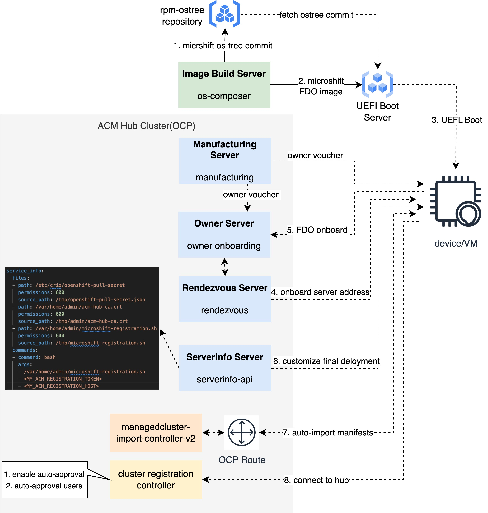

# MicroShift Registration to ACM using FDO demo

This demo shows the deployment of a RHEL for Edge system embedding MicroShift registered in [Red Hat Advanced Cluster Management for Kubernetes](https://www.redhat.com/en/technologies/management/advanced-cluster-management) using [FIDO Device Onboard](https://fidoalliance.org/intro-to-fido-device-onboard/), so you won't need to include any sensitive information into the ISO image that you will need to deliver to deploy the system, and with the local Cockpit GUI tool installed.

> NOTE: Tested with RHEL 9.2

## Overview



## Preparing the demo

The steps to prepare this demo are:

0) Make sure you have a RHEL 9 bare metal machine at least 32GB of RAM and 16 vCPUs.

1) Install RHACM (>= 2.9.0) following steps here: https://github.com/stolostron/deploy, for example, you can install RHACM upstream build `2.9.0-SNAPSHOT-2023-08-26-04-49-14` in AWS.

2) Log into the RHACM hub cluster from your RHEL machine and enable auto approval for registration controller:

```shell
cat << EOF > /tmp/clustermanager_patch.yaml
apiVersion: operator.open-cluster-management.io/v1
kind: ClusterManager
metadata:
  name: cluster-manager
spec:
  registrationConfiguration:
    featureGates:
      - feature: ManagedClusterAutoApproval
        mode: Enable
    autoApproveUsers:
      - system:serviceaccount:multicluster-engine:agent-registration-bootstrap
EOF

kubectl patch clustermanager cluster-manager --type=merge --patch-file "/tmp/clustermanager_patch.yaml"
```

3) Log into the RHACM hub cluster and create serviceaccount token for registration controller:

```shell
cat << EOF | kubectl apply -f -
apiVersion: v1
kind: ServiceAccount
metadata:
  name: managed-cluster-import-agent-registration-sa
  namespace: multicluster-engine
---
apiVersion: v1
kind: Secret
type: kubernetes.io/service-account-token
metadata:
  name: managed-cluster-import-agent-registration-sa-token
  namespace: multicluster-engine
  annotations:
    kubernetes.io/service-account.name: "managed-cluster-import-agent-registration-sa"
---
kind: ClusterRoleBinding
apiVersion: rbac.authorization.k8s.io/v1
metadata:
  name: managed-cluster-import-agent-registration
roleRef:
  apiGroup: rbac.authorization.k8s.io
  kind: ClusterRole
  name: managedcluster-import-controller-agent-regitration-client
subjects:
  - kind: ServiceAccount
    name: managed-cluster-import-agent-registration-sa
    namespace: multicluster-engine
EOF

kubectl get configmap -n kube-system kube-root-ca.crt -o=jsonpath="{.data['ca\.crt']}" > ${PWD}/fdo-configs/device0/var/home/admin/acm-hub-ca.crt
export MY_ACM_REGISTRATION_TOKEN=$(kubectl get secret -n multicluster-engine managed-cluster-import-agent-registration-sa-token -o=jsonpath='{.data.token}' | base64 -d)
export MY_ACM_REGISTRATION_HOST=$(kubectl get route -n multicluster-engine agent-registration -o=jsonpath="{.spec.host}")
```

4) In the FDO `serviceinfo_api_server.yml.example` file. include
* Your public SSH key - `export SSHKEY=<MY_SSH_PUBLIC_KEY>`
* The right disk drive (`disk_label` parameter)
* Your OpenShift pull secret - `cp <MY_PULL_SECRET_FILE> fdo-configs/device0/var/home/admin/openshift-pull-secret.json`
* Your ACM Hub cluster CA - `cp <MY_ACM_HUB_CA> fdo-configs/device0/var/home/admin/acm-hub-ca.crt` (done in the last step)
* Your ACM registration token - `export MY_ACM_REGISTRATION_TOKEN=<MY_ACM_REGISTRATION_TOKEN>` (done in the last step)
* Your ACM registration host - `export MY_ACM_REGISTRATION_HOST=<MY_ACM_REGISTRATION_HOST>` (done in the last step)


> NOTE: There are other parameters such as `service_info_auth_token` and `admin_auth_token` that will be filled in by the `prepare-fdo-server.sh` during next step.

> NOTE: The file `serviceinfo_api_server.yml.example` has configured the usage of a TPM device to encrypt the disk, so be sure that you device or VM has a TPM or remove that section from the file.

5) Run the `prepare-fdo-server.sh` script to prepare the required files on the fdo server, which completes the information contained by `serviceinfo_api_server.yml.example` and make it affective in the FDO service running on the server. 


6) Prepare the blueprint using the `blueprint-microshift-acm.toml.example` as reference including the ssh key and user information.

Make a copy of the blueprint example file (ie, `cp blueprint-microshift-acm.toml.example ../../blueprint-microshift.toml`) and include the SSH key and the password hash.

7) Back to the root folder (`cd ../../`) and use the `blueprint-microshift.toml` with option #3 of the [Network based deployment methods](https://github.com/luisarizmendi/rhel-edge-quickstart#option-3-uefi-http-boot-using-the-custom-rhel-iso).

Example using default values and `vda`` as disk where to install the OS:

```shell
# deploy image builder
./0-pre-requisites-osbuild.sh

# add microshift repos
./scripts/add-microshift-repos.sh

# create microshift ostree commit
./1-create-image.sh -b blueprint-microshift.toml

# create and publish os image
./2-publish-image.sh -i <image-id> -x 8091 -d vda
```

## Running the demo

The demo will focus first on managing and get some information directly from the device and then move to the console of [Red Hat Advanced Cluster Management for Kubernetes](https://www.redhat.com/en/technologies/management/advanced-cluster-management) and show how the MicroShift cluster running on the device is registered and managed.

0) Run the following command to install libvirt and relevant packages in your RHEL machine:

```shell
dnf install -y libvirt virt-manager virt-install virt-viewer libvirt-client qemu-kvm qemu-img cockpit-machines
systemctl enable --now libvirtd.service
firewall-cmd --add-port=8080-8083/tcp --permanent --zone libvirt 2>/dev/null # add fdo service ports to libvirt zone
firewall-cmd --reload 2>/dev/null
```

1) Configure the network of your RHEL machine to include the UEFI HTTP boot server as a DHCP option:

```shell
virsh net-list
virsh net-edit default # see the following example network for exiting operation
virsh net-destroy default
mkdir -p /var/lib/tftpboot
virsh net-start default
```

> Note: If you are using libvirt and VMs this is an example of the libvirt network setup:
```xml
<network xmlns:dnsmasq="http://libvirt.org/schemas/network/dnsmasq/1.0">
  <name>default</name>
  <uuid>3a4b328c-f199-476b-bfc6-d79043f07019</uuid>
  <forward mode='nat'>
    <nat>
      <port start='1024' end='65535'/>
    </nat>
  </forward>
  <bridge name='virbr0' stp='on' delay='0'/>
  <mac address='52:54:00:be:34:21'/>
  <ip address='192.168.122.1' netmask='255.255.255.0'>
    <tftp root="/var/lib/tftpboot"/>
    <dhcp>
      <range start='192.168.122.2' end='192.168.122.254'/>
      <bootp file="pxelinux.0"/>
    </dhcp>
  </ip>
  <dnsmasq:options>
    <dnsmasq:option value="dhcp-vendorclass=set:efi-http,HTTPClient:Arch:00016"/>
    <dnsmasq:option value="dhcp-option-force=tag:efi-http,60,HTTPClient"/>
    <dnsmasq:option value="dhcp-boot=tag:efi-http,&quot;http://192.168.122.1:8091/EFI/BOOT/BOOTX64.EFI&quot;"/>
    <dnsmasq:option value='log-queries'/>
    <dnsmasq:option value='log-dhcp'/>
    <dnsmasq:option value='log-debug'/>
  </dnsmasq:options>
</network>
```

2) Deploy the edge server by starting using UEFI boot and the NIC as the device for the first boot. You will find that the boot will attempt to use PXE boot before UEFI HTTP boot...so you will need to wait a bit until the install begins.

> NOTE: Your Edge server must have at least 2GB of RAM in order to download the ISO to memory during the installation process

```shell
virt-install \
    --name=edge-microshift-fdo-test-1 \
    --disk path=./edge-microshift-fdo-test-1.qcow2,size=20 \
    --ram=2048 \
    --vcpus=2 \
    --os-type=linux \
    --os-variant=rhel9.2 \
    --network=network=default,model=virtio \
    --boot uefi
```

3) Log into the VM after the VM reboot with configured username and password.

```shell
virsh domifaddr edge-microshift-fdo-test-1
ssh admin@${VM_IP} #admin/admin
```

> NOTE: After the deployment it could take some time until the fdo-client runs and configures everything. You can double check if that happened taking a look at the Journal (`journalctl | grep "Performing TO2 protocol"`) or forcing it with `systemctl restart fdo-client-linuxapp.service`.

### Verify the device is on boarded

1. Log into the device and check FDO device credential:

```shell
# fdo-owner-tool dump-device-credential /boot/device-credentials
Active: true
Protocol Version: 101
Device Info:
Device GUID: 343a5e10-9476-7758-b503-ae5fa8ec8290
Rendezvous Info:
	- [(DevicePort, [25, 31, 146]), (IPAddress, [68, 10, 73, 130, 147]), (OwnerPort, [25, 31, 146]), (Protocol, [1])]
Public key hash: e1c3a8005c66ac1c50d39b3843852c9bf76c3466dc1811670ac7defbf11a64c90adca6307c079aa39cc646114423efb3 (Sha384)
HMAC and signing key:
	HMAC key: <secret>
	Signing key: <secret>
```

2. Check the device credential on FDO server:

```shell
# tree /etc/fdo/aio/stores/
/etc/fdo/aio/stores/
├── manufacturer_keys
├── manufacturing_sessions
│   └── LkuV4CKOJT_slash_6cuprfMMmpMjbi+wOcBueAdJgaSCF3Tg=
├── mfg_sessions
├── owner_onboarding_sessions
│   └── FjK7WKe6uzDEW9YzLJpn5WWSvEKSLqKx3kRwEnXodXM=
├── owner_sessions
├── owner_vouchers
│   └── 467a9a74-dea5-ba46-409b-c49a57178e38
├── rendezvous_registered
│   └── 467a9a74-dea5-ba46-409b-c49a57178e38
├── rendezvous_sessions
│   ├── dgV9fsqVgZR6QZ4GYn9UBTtzzAsjiHiMubnAmUQXB7o=
│   └── GJC_slash_yiS5tavq9BjwUiF3jg5MNkk_slash_5048iFSyZh4OGoo=
├── serviceinfo_api_devices
└── serviceinfo_api_per_device

10 directories, 6 files
```

### Verify MicroShift cluster is registered to ACM

1. Log into the device and check the klusterlet pod:

```shell
# oc get pod -A
NAMESPACE                                     NAME                                               READY   STATUS    RESTARTS        AGE
open-cluster-management-addon-observability   endpoint-observability-operator-7978f664bf-gb8kn   1/1     Running   0               4m53s
open-cluster-management-agent-addon           application-manager-7f77d584b7-qcn6l               1/1     Running   0               4m49s
open-cluster-management-agent-addon           cert-policy-controller-6655d84f57-b6fm5            1/1     Running   0               4m54s
open-cluster-management-agent-addon           cluster-proxy-proxy-agent-6b897dd757-mb2sv         2/2     Running   0               4m52s
open-cluster-management-agent-addon           cluster-proxy-service-proxy-5bcf75fb98-htrgp       1/1     Running   0               4m52s
open-cluster-management-agent-addon           config-policy-controller-5c4c8cbc7d-88dqp          1/1     Running   0               4m47s
open-cluster-management-agent-addon           governance-policy-framework-7994bdf9d8-5lfsj       1/1     Running   1 (91s ago)     4m48s
open-cluster-management-agent-addon           iam-policy-controller-84595bbd5f-l9cz7             1/1     Running   0               4m48s
open-cluster-management-agent-addon           klusterlet-addon-workmgr-5479cb65d6-rd2hl          1/1     Running   0               4m53s
open-cluster-management-agent                 klusterlet-74c99cfbd-2xkvs                         1/1     Running   0               8m25s
open-cluster-management-agent                 klusterlet-registration-agent-7f56696bb-b4qxw      1/1     Running   1 (106s ago)    117s
open-cluster-management-agent                 klusterlet-work-agent-59d5f86964-47227             1/1     Running   0               5m53s
openshift-dns                                 dns-default-tj52c                                  2/2     Running   0               7m33s
openshift-dns                                 node-resolver-8tv6x                                1/1     Running   0               10m
openshift-ingress                             router-default-75f7dff5c4-qnrrc                    1/1     Running   0               10m
openshift-ovn-kubernetes                      ovnkube-master-92pf4                               4/4     Running   0               10m
openshift-ovn-kubernetes                      ovnkube-node-w7w4g                                 1/1     Running   1 (7m34s ago)   10m
openshift-service-ca                          service-ca-857cbb9846-wj7qw                        1/1     Running   0               10m
openshift-storage                             topolvm-controller-f58fcd7cb-42bf7                 4/4     Running   6 (2m40s ago)   10m
openshift-storage                             topolvm-node-w26f7                                 4/4     Running   0               7m33s
```

> Note: If the klusterlet is not up and running, you can check the Journal (`journalctl | grep "fdo`) for more details.

2. Log into the ACM Hub cluster and check the cluster is registered

```shell
# oc get mcl
NAME              HUB ACCEPTED   MANAGED CLUSTER URLS                                                            JOINED   AVAILABLE   AGE
local-cluster     true           https://api.obs-hub-of-hubs-aws-410-sno-9vvxs.scale.red-chesterfield.com:6443   True     True        3d1h
microshift-enQxb  true                                                                                           True     True        8m25s
```
